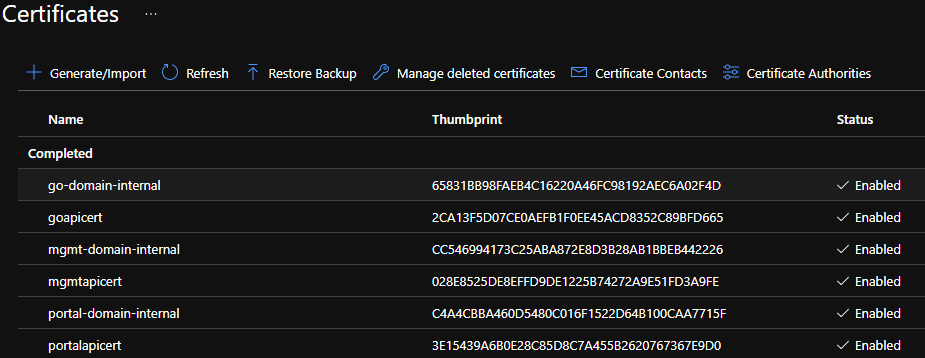

# Prerequisites
Create 3 certificates for the internal endpoints (gateway, portal and management endpoint). Using a wildcard certificate would have simplified the configuration.

## use openssl to create the certificates for the .internal domain

self-signed CA
```
#1 - create the root key
.\openssl.exe genrsa -des3 -out .\sample\internal-CA.key 4096

#2 - create and self sign the Root Certificate
.\openssl.exe req -x509 -new -nodes -key .\sample\internal-CA.key -sha256 -days 1024 -out .\sample\internal-rootCA-selfsigned.crt

#3 - Get CER of the root CA
.\openssl.exe x509 -inform pem -in .\sample\internal-rootCA-selfsigned.crt -outform der -out .\sample\internal-rootCA-selfsigned.cer
```

for the gateway, portal and management endpoint repeat the following
```
#1 - Create the signing request
.\openssl.exe req -new -key .\sample\internal-CA.key -out .\sample\go\go-domain-internal.csr

#2 - check the CSR content
.\openssl.exe req -in .\sample\go\go-domain-internal.csr -noout -text

#3 - Generate the certificate using the mydomain csr and key along with the CA Root key
.\openssl.exe x509 -req -in .\sample\go\go-domain-internal.csr -CA .\sample\internal-rootCA-selfsigned.crt -CAkey .\sample\internal-CA.key -CAcreateserial -out .\sample\go\go-domain-internal.crt -days 500 -sha256

#4 - Create .pfx file from the .crt and private.key  (p@ssword)
.\openssl.exe pkcs12 -export -out .\sample\go\go-domain-internal.pfx -inkey .\sample\internal-CA.key -in .\sample\go\go-domain-internal.crt

```

result

```
│   internal-CA.key
│   internal-rootCA-selfsigned.cer
│   internal-rootCA-selfsigned.crt
│   internal-rootCA-selfsigned.srl
│
├───go
│       go-domain-internal.crt
│       go-domain-internal.csr
│       go-domain-internal.pfx
│
├───mgmt
│       mgmt-domain-internal.crt
│       mgmt-domain-internal.csr
│       mgmt-domain-internal.pfx
│
└───portal
        portal-domain-internal.crt
        portal-domain-internal.csr
        portal-domain-internal.pfx
```

## create the certificates for the external domain
For this example I used https://www.sslforfree.com/. To create the PFX from private key and CRT, I used the following commands.

```
openssl.exe pkcs12 -export -out goapicert.pfx -inkey "C:\ZeroSSL\go\private.key" -in "C:\ZeroSSL\go\certificate.crt"

openssl.exe pkcs12 -export -out mgmtapicert.pfx -inkey "C:\ZeroSSL\mgmt\private.key" -in "C:\ZeroSSL\mgmt\certificate.crt" 

openssl.exe pkcs12 -export -out portalpicert.pfx -inkey "C:\ZeroSSL\portal\private.key" -in "C:\ZeroSSL\portal\certificate.crt"
```

## create the user assigned MSI

```
az identity create -g rg-bicep -n cdt-msi-dev-2020
```

## keyvault configuration

- create a keyvault
- load the internal and external certificates
- configure the access policies to grant access to the user-assigned managed identity (cdt-msi-dev-2020)

6 certificates have been uploaded



add the trusted root CA as secret to KeyVault

```
$vaultName = "cdt-key-dev-2020"
$secretName = "trustedrootca-domain-internal"
$certFilePath = "./internal-rootCA-selfsigned.cer"

$certData = get-content $certFilePath -Encoding Byte 
$certDataB64 = [System.Convert]::ToBase64String($certData)
$certDataSecure = ConvertTo-SecureString -String $certDataB64 -AsPlainText -Force

Set-AzKeyVaultSecret -VaultName $vaultName -Name $secretName  -SecretValue $certDataSecure -ContentType 'application/x-pkcs12'
```